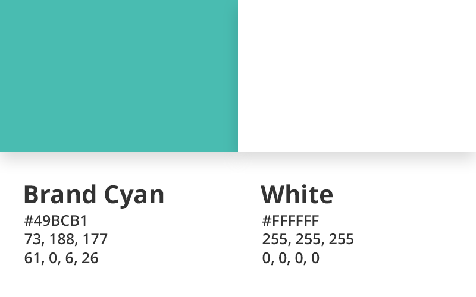

# Fomantic Branding Assets
All assets within this repository are released under [MIT license](LICENSE.md) and may be used as you wish.

### Files:
  - Logo PNG
    - [1024x1024](assets/logo/png/1024.png)
    - [512x512](assets/logo/png/512.png)
    - [256x256](assets/logo/png/256.png)
    - [128x128](assets/logo/png/128.png)
    - [64x64](assets/logo/png/64.png)
    - [32x32](assets/logo/png/32.png)
  - Logo JPG
    - [1024x1024](assets/logo/jpg/1024.jpg)
    - [512x512](assets/logo/jpg/512.jpg)
    - [256x256](assets/logo/jpg/256.jpg)
    - [128x128](assets/logo/jpg/128.jpg)
    - [64x64](assets/logo/jpg/64.jpg)
    - [32x32](assets/logo/jpg/32.jpg)
  - [Logo AI](assets/logo.ai)
  - [Logo SVG](assets/logo.svg)
  - [Twitter Banner](assets/twitter-banner/twitter-banner.png)
  - [Discord Invite Background](assets/discord-invite-background/discord-invite-background.png)
  - [GitHub Social Image](assets/github-social-image/github-social-image.png)

### Colors:

